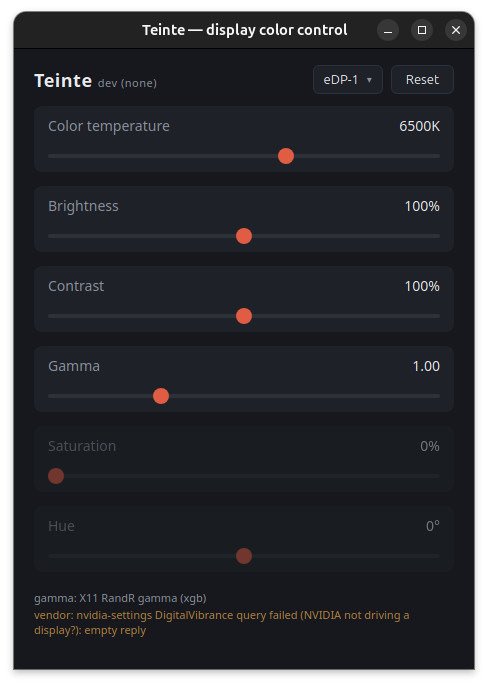

# Teinte

[](https://github.com/creativeyann17/teinte/releases)
[](https://github.com/creativeyann17/teinte/actions/workflows/ci.yml)
[](LICENSE)
[](https://buymeacoffee.com/creativeyann17)

Per-display color control for Windows & Linux: **temperature, brightness,
contrast, gamma, saturation and hue** — for any GPU, without vendor bloat.



## Why this exists

Every laptop I buy ships with a washed-out, yellowish panel. AMD Adrenalin
has a great custom color panel that fixes it… but it only works while the
AMD iGPU drives the display. Flip the MUX to the discrete NVIDIA GPU for
gaming and those settings are gone — and the NVIDIA app offers **no color
controls at all**. The usual answer is installing heavy vendor suites I
don't want on my machines.

Teinte replaces that panel with one small tool that works on **both sides
of the MUX switch**, on Windows and Linux, with your settings saved per
display and reapplied automatically.

- Sliders apply live, per display (dropdown top-right)
- Settings persist as plain JSON, reapplied at startup
- Closes to the system tray; `teinte --apply` applies your colors headless
  and exits — perfect for autostart at login
- Anything your driver can't do is simply disabled, with the reason shown
  in the footer — no silent failures

## How it works (short version)

| Controls | Mechanism |
|---|---|
| Temperature, brightness, contrast, gamma | Hardware gamma ramp (GDI on Windows, X11 RandR on Linux) — works on any GPU, per display |
| Saturation, hue | GPU driver APIs, probed automatically: NVIDIA NvAPI, AMD ADL (the API behind Adrenalin), or `nvidia-settings` on Linux |

The color math is pure, unit-tested Go; the OS-specific code sits behind
build tags. Built with [Wails v2](https://wails.io) — a single small
binary, no runtime dependencies.

Good to know:

- **Windows**: for strong corrections, import
  [`build/windows/enable-full-gamma-range.reg`](build/windows/enable-full-gamma-range.reg)
  once (admin) — Windows otherwise clamps gamma ramps to a narrow range.
- **Linux**: X11 session required for gamma (Wayland not supported yet);
  saturation needs the NVIDIA GPU to drive a display.
- Saturation/hue are per GPU (all its displays), gamma controls are per
  display.

## Install

Grab a binary from [Releases](https://github.com/creativeyann17/teinte/releases),
or build from source:

```sh
make install   # go mod download + bun install
make dev       # hot-reload dev mode
make test      # unit tests
make build     # Windows exe (cross-compiles from Linux)
make run       # build & run the Linux binary
```

## Autostart

- Linux: `~/.config/autostart/teinte.desktop` with `Exec=/path/to/teinte --apply`
- Windows: Startup shortcut or `HKCU\...\Run` entry with `teinte.exe --apply`

## License

[MIT](LICENSE) — if Teinte saved your eyes, consider
[buying me a coffee](https://buymeacoffee.com/creativeyann17) ☕
